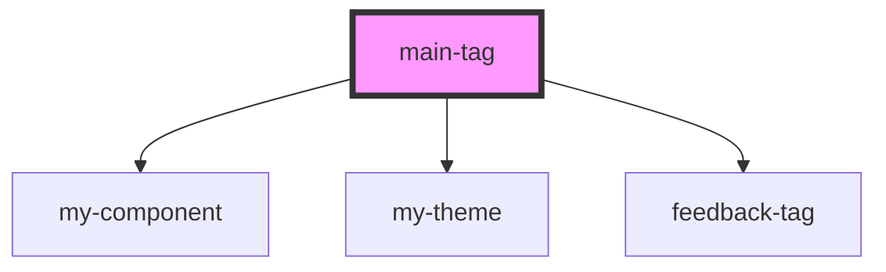

# main-tag

<!-- Auto Generated Below -->

## Properties

| Property | Attribute | Description | Type  | Default     |
| -------- | --------- | ----------- | ----- | ----------- |
| `_id`    | `_id`     |             | `any` | `undefined` |

## Dependencies

### Depends on

- [my-component](../my-component)
- [my-theme](../my-theme)
- [feedback-tag](../feedback-tag)

### Graph

----------------------------------------------

*Built with [StencilJS](https://stenciljs.com/)*
